# ProBuild - Aplicación de Builds para Héroes de Dota 2

**ProBuild** es una aplicación móvil orientada a los jugadores de Dota 2 que desean crear, explorar y compartir builds personalizadas para los distintos héroes del juego.  
La aplicación incorpora un sistema de roles que permite a los usuarios enviar builds y al administrador aprobarlas, así como gestionar los héroes disponibles en el sistema.

---

## 🎯 Descripción del Proyecto

ProBuild facilita a los usuarios la creación de builds para héroes de Dota 2, segmentadas por fases del juego (Early Game y Late Game).  
Los usuarios pueden buscar builds existentes, enviar sus propias combinaciones de ítems y ver sus builds con estados de aprobación.

Por otro lado, los administradores tienen acceso a un panel exclusivo donde pueden aprobar o rechazar las builds enviadas, así como registrar nuevos héroes y agregar ítems al catálogo general.

La app busca combinar una experiencia de usuario amigable con una arquitectura robusta y segura para la gestión de contenido.

---

## ⚙️ Guía de Desarrollo del Proyecto ProBuild

### 🚀 Entorno de Desarrollo

El desarrollo de la aplicación **ProBuild** se lleva a cabo utilizando **Flutter**, un framework multiplataforma que permite compilar aplicaciones nativas para Android e iOS desde una sola base de código.  
Para la ejecución en dispositivos Android, se utiliza **Android Studio** como entorno de desarrollo, administración de emuladores y gestión de SDKs.

> **Tecnologías clave:**
> - [Flutter (Sitio oficial)](https://flutter.dev)  
> - [Android Studio (Sitio oficial)](https://developer.android.com/studio)

---

### 📥 Instalación del SDK de Flutter

Para configurar Flutter en tu máquina:

1. Ve al sitio oficial de Flutter: [flutter.dev](https://flutter.dev) y descarga el archivo ZIP del SDK según tu sistema operativo.
2. Extrae el contenido en una ruta **sin espacios ni caracteres especiales**.  
   - Ejemplo recomendado: `C:\\flutter\\` o `/usr/local/flutter/`

> ⚠️ **Evita directorios como `C:\\Program Files`**, ya que pueden generar problemas por permisos restringidos.

---

### 🛠️ Configuración de Variables de Entorno

Después de instalar Flutter, es necesario asegurarse de que los comandos de Flutter estén disponibles en la terminal:

1. Accede a las **Propiedades del Sistema**:  
   `Panel de control > Sistema > Configuración avanzada del sistema > Variables de entorno`
2. Busca la variable `Path` dentro del apartado "Variables del sistema" y selecciona **Editar**.
3. Añade la ruta completa hacia la carpeta `flutter/bin`.  
   - Ejemplo: `C:\\flutter\\bin` o `/usr/local/flutter/bin`

💡 Verifica la instalación ejecutando este comando en tu terminal o consola:


```bash
flutter --version
```

### ✅ Verificación Final del Entorno

Para confirmar que el entorno está correctamente configurado, ejecuta:

```bash
flutter doctor
```


---

## 📌 Requisitos No Funcionales

### 🔒 Seguridad

- **RNF01:**  
  El sistema deberá garantizar la protección de las credenciales de acceso de los usuarios utilizando técnicas de encriptación segura (por ejemplo, hash con sal usando algoritmos como SHA-256 o bcrypt). Esta medida evitará el almacenamiento de contraseñas en texto plano y reducirá el riesgo ante accesos no autorizados.

- **RNF02:**  
  El acceso al panel administrativo estará restringido únicamente a usuarios con el rol "admin". Esto será validado durante el proceso de autenticación y verificado en cada acceso a rutas protegidas dentro de la aplicación.

---

### 📱 Usabilidad

- **RNF03:**  
  La interfaz de usuario (UI) debe ser sencilla, amigable y comprensible incluso para usuarios que no tengan experiencia previa con aplicaciones móviles o videojuegos. Se priorizará el uso de iconos, botones claros, navegación coherente y retroalimentación visual ante errores o acciones exitosas.

- **RNF04:**  
  Todos los formularios de la aplicación deben contar con validaciones que impidan el envío de campos vacíos, inválidos o mal formateados (por ejemplo, correos mal escritos o builds sin ítems). Los usuarios deben recibir mensajes de error claros y específicos.

---

### ⚙ Rendimiento

- **RNF05:**  
  La aplicación debe responder de forma eficiente y mantener un tiempo de carga inferior a 2 segundos al listar builds, héroes o contenido clave, siempre que se cuente con una conexión a internet estable.

- **RNF06:**  
  Las imágenes utilizadas (de ítems y héroes) deben estar comprimidas y optimizadas para evitar un alto consumo de datos y garantizar una experiencia fluida en dispositivos de gama media o baja.

---

### 💾 Persistencia

- **RNF07:**  
  Toda la información crítica del sistema (builds, usuarios, héroes e ítems) debe almacenarse en una base de datos confiable y persistente (local o remota), asegurando que los datos no se pierdan al cerrar la app o reiniciar el dispositivo.

- **RNF08:**  
  Las builds que hayan sido rechazadas por un administrador no deben ser visibles en la sección de búsqueda pública ni en el listado general de builds por héroe. Solo el creador podrá verlas desde su cuenta.

---

### 🔄 Mantenibilidad

- **RNF09:**  
  El código fuente de la aplicación debe estar organizado por módulos o componentes reutilizables, respetando principios de diseño limpio (Clean Code). Esto facilitará futuras mejoras, correcciones de errores o implementación de nuevas funcionalidades.

- **RNF10:**  
  El sistema de gestión de ítems y héroes debe estar desacoplado de la lógica principal para permitir añadir o modificar contenido sin necesidad de recompilar ni actualizar la app desde las tiendas.

---

### 🌐 Accesibilidad

- **RNF11:**  
  La aplicación debe ser totalmente funcional en dispositivos con sistema operativo **Android 8.0 (API 26)** o superior, cubriendo así un rango amplio de compatibilidad con smartphones activos en el mercado.

- **RNF12:**  
  La interfaz debe respetar buenas prácticas de accesibilidad, como contraste suficiente entre texto y fondo, tamaños de fuente legibles y uso adecuado de colores para personas con daltonismo. Además, debe ser navegable con gestos básicos sin necesidad de periféricos adicionales.

---


---

## 📝 Descripción Casos de Uso 
## RF01: Registro del Usuario

El sistema debe permitir a los nuevos usuarios registrarse ingresando su correo electrónico, contraseña, distrito, apellidos y sexo.  
Todos los campos son obligatorios y deben validarse antes del envío del formulario.  
Al completar el registro, el usuario será redirigido a la pantalla de inicio de sesión.

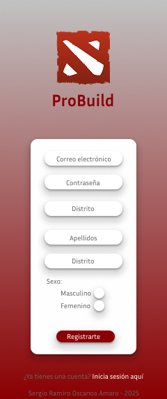
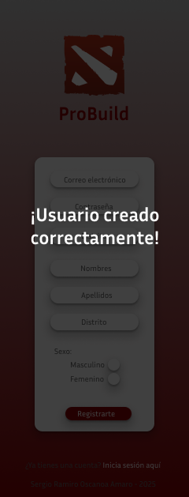

---

## RF02: Inicio de sesión del usuario

El sistema debe permitir que el usuario inicie sesión correctamente ingresando su **correo electrónico** y **contraseña** registrados.  
Antes de otorgar acceso, el sistema debe **autenticar las credenciales** verificando que correspondan a un usuario válido en la base de datos.  
Si las credenciales son correctas, el sistema debe **redirigir al usuario a la pantalla principal correspondiente a su rol (usuario o administrador)**.  
Si las credenciales no son válidas, el sistema debe **mostrar un mensaje de error claro** y evitar el acceso.

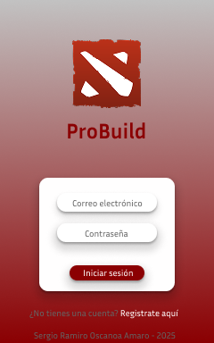

---

## RF03: Navegación principal para el usuario

El sistema debe proporcionar una interfaz de navegación clara e intuitiva para los usuarios que acceden al sistema con rol "usuario".  
Esta navegación debe incluir:

- Un **encabezado (header)** con el logo de la aplicación y botones de acción relevantes como “Crear build” y “Buscar build”.
- Un apartado visual destacado para mostrar las **builds personales** del usuario.
- Una sección con las **builds destacadas del mes** (ej. por popularidad o curación).
- Una **barra de navegación inferior** con íconos fácilmente reconocibles, que permita al usuario acceder rápidamente a las principales secciones:
  - Página principal (home)
  - Crear nueva build
  - Buscar builds
  - Perfil o ajustes

Esta estructura de navegación debe ser consistente en toda la app, y debe facilitar la exploración del contenido sin necesidad de múltiples pasos o menús ocultos.


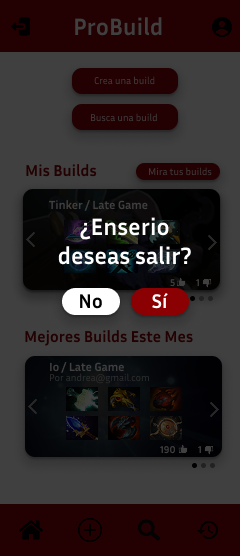

---

### RF04: Creación de builds personalizadas

El sistema debe permitir al usuario crear una build personalizada para un héroe de Dota 2, especificando los siguientes elementos:

- **Fase del juego:** Debe seleccionar si la build aplica para **Early Game** o **Late Game**.
- **Héroe:** El sistema debe desplegar una lista de héroes disponibles para que el usuario seleccione uno.
- **Ítems:** El usuario debe elegir **exactamente 6 ítems** desde una lista desplegable de opciones, cada uno representado por su imagen.
- **Comentario:** Se debe permitir al usuario añadir una breve descripción o estrategia de uso para su build.

Una vez completado el formulario, el usuario podrá presionar un botón para **enviar la build**, la cual se almacenará con estado “pendiente” hasta ser aprobada o rechazada por un administrador.

El sistema debe validar que:
- Todos los campos estén completos.
- Se hayan seleccionado 6 ítems.
- El héroe y la fase sean válidos.

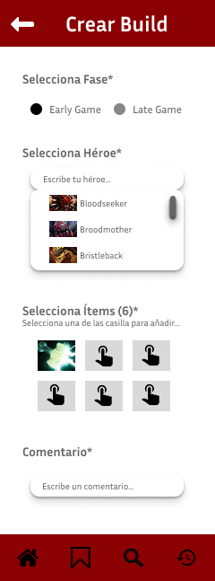
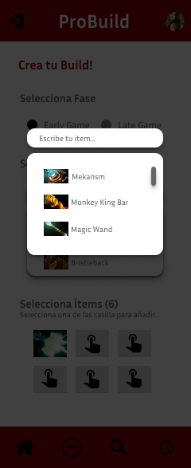

### RF05: Búsqueda de builds por héroe y fase

El sistema debe permitir al usuario buscar builds existentes a partir de dos filtros principales:

1. **Nombre del Héroe:** El usuario podrá ingresar el nombre del héroe en un campo de búsqueda desplegable, el cual mostrará sugerencias visuales con nombre e imagen.

2. **Fase del Juego:** El usuario deberá seleccionar si desea ver builds correspondientes a la fase **Early Game** o **Late Game**.

Una vez aplicados ambos filtros, el sistema debe mostrar una lista de resultados que cumplan con los criterios seleccionados.  
Cada resultado debe incluir:

- Nombre del héroe y fase
- Autor de la build (correo)
- Vista previa de los ítems
- Cantidad de votos positivos y negativos
- Botón para ver el detalle completo de la build

El sistema debe actualizar los resultados automáticamente cada vez que el usuario modifique los filtros.

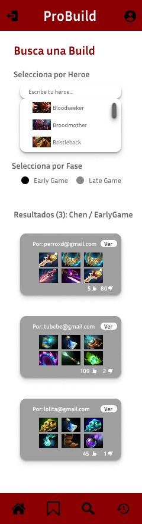

---

### RF06: Eliminación de builds personales desde su vista detallada

El sistema debe permitir al usuario **eliminar una build propia** desde la pantalla de detalle, siempre que él sea el creador de dicha build.  
Esta opción debe estar visible mediante un botón claramente identificado como **“Eliminar Build”** al final del contenido.

Antes de proceder con la eliminación, el sistema debe:

- Verificar que el usuario autenticado sea el autor de la build.
- Mostrar un mensaje de confirmación que pregunte si está seguro de eliminar la build.
- Eliminar la build de la base de datos en caso de confirmación positiva.
- Redirigir al usuario a la pantalla principal o de “Mis Builds” después de la eliminación exitosa.

Esta funcionalidad evita modificaciones accidentales y garantiza el control de los usuarios sobre su propio contenido.

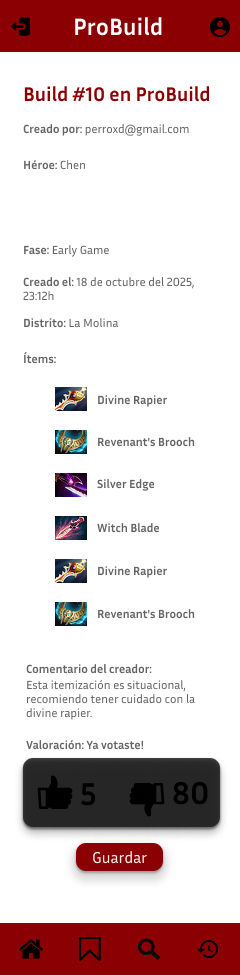
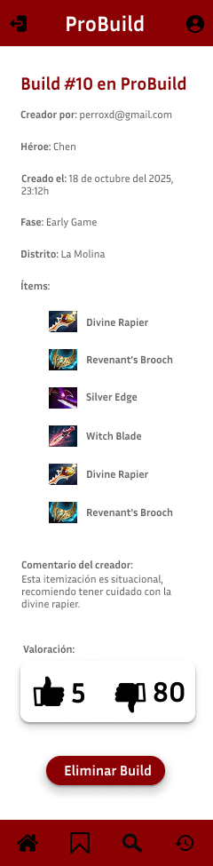

---

### RF07: Visualización de builds personales con filtro de estado

El sistema debe permitir al usuario acceder a una sección donde pueda consultar únicamente las builds que **él ha creado**.

Esta vista debe mostrar:

- El **total de builds creadas** por el usuario.
- Un **filtro visual** que permita alternar entre:
  - **Builds Aprobadas**: aquellas que ya han sido revisadas y aceptadas por el administrador.
  - **Builds Pendientes**: aquellas que aún están en estado de revisión y que el administrador no ha aprobado o rechazado.

Cada build listada debe incluir una tarjeta con:
- Imagen de ítems
- Nombre del héroe y fase
- Número de votos
- Botón “Ver” para acceder al detalle completo

El sistema debe actualizar la lista automáticamente al cambiar de filtro.

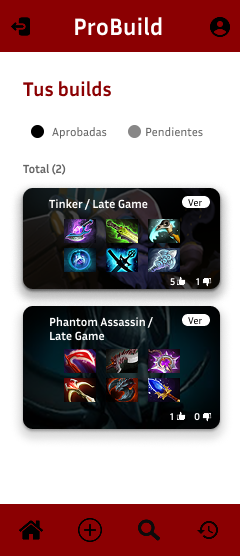
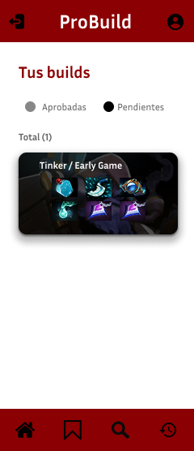

---

### RF08: Edición del perfil de usuario

El sistema debe permitir al usuario acceder a una sección denominada **"Mi Perfil"**, donde podrá consultar y actualizar sus datos personales.

Los campos editables incluyen:
- Contraseña (con opción de mostrar/ocultar)
- Distrito
- Nombres
- Apellidos

El sistema debe:
- Cargar automáticamente los datos actuales del usuario autenticado.
- Validar que ningún campo esté vacío antes de actualizar.
- Actualizar la información en la base de datos al presionar el botón “Actualizar”.
- Mostrar un mensaje de confirmación una vez que la actualización haya sido exitosa.

También incluye la funcionalidad de **actualizar foto de perfil**.

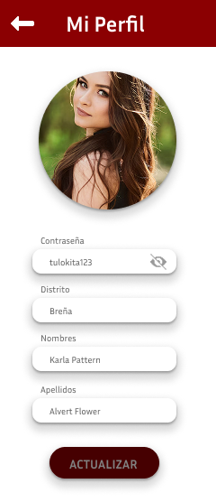

---

### RF09: Acceso al panel de administración

El sistema debe mostrar un **panel exclusivo** para usuarios con rol “admin” luego de autenticarse correctamente.  
Desde este panel, el administrador podrá acceder rápidamente a las siguientes funciones mediante botones visibles:

- Revisión de builds pendientes
- Registro de nuevos héroes
- Registro de nuevos ítems

El diseño debe ser claro, centrado en la acción, y estar acompañado por una **barra de navegación inferior** específica para el administrador.

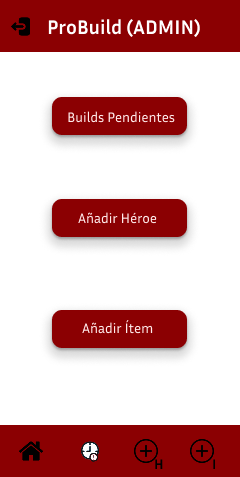

---

### RF10: Revisión y gestión de builds pendientes

El sistema debe mostrar al administrador una lista de **builds enviadas por usuarios** que se encuentren en estado “pendiente”.

Cada elemento de la lista debe incluir:
- Nombre del héroe y fase
- Correo del autor
- Fecha de envío
- Comentario de la build
- Ítems incluidos (visualmente)

El administrador podrá tomar una decisión con los botones:
- ✅ Aceptar → cambia el estado a “Aprobado”
- ❌ Rechazar → cambia el estado a “Rechazado”

La acción debe guardarse en la base de datos y desaparecer de la lista automáticamente.

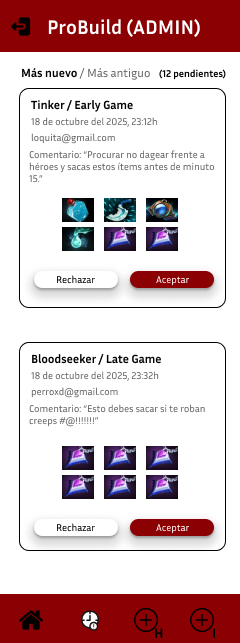

---

### RF11: Registro de nuevos héroes

El sistema debe permitir al administrador agregar nuevos héroes al catálogo disponible para los usuarios.

Para ello, debe completar:
- Nombre del héroe (campo obligatorio, máximo 40 caracteres)
- Imagen representativa del héroe (upload o selector)

Al presionar el botón “Aceptar”:
- Se valida que el nombre no esté vacío.
- Se guarda el nuevo héroe en la base de datos.
- El nuevo héroe aparece disponible para creación de builds.

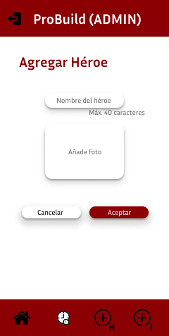
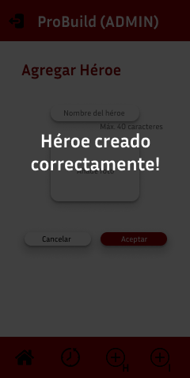

---

### RF12: Registro de nuevos ítems

El sistema debe permitir al administrador registrar nuevos ítems utilizables en las builds.

Debe completarse:
- Nombre del ítem (campo obligatorio, máximo 40 caracteres)
- Imagen del ítem

Al presionar “Aceptar”, el ítem se guarda en el sistema y será visible en el componente selector de ítems al momento de crear una build.

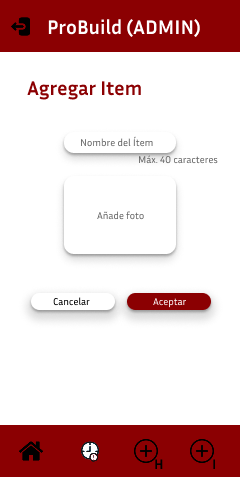
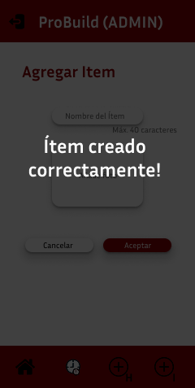


